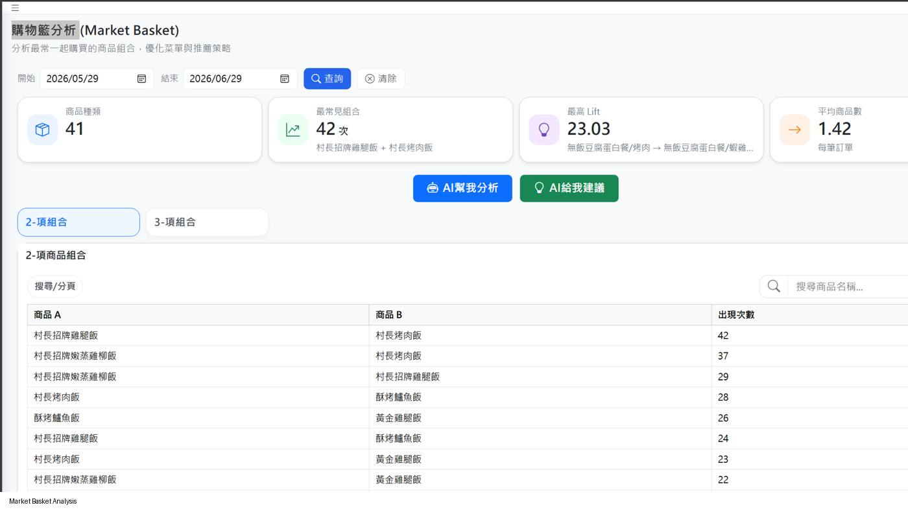
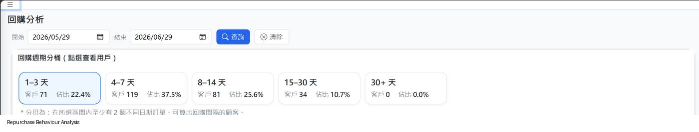
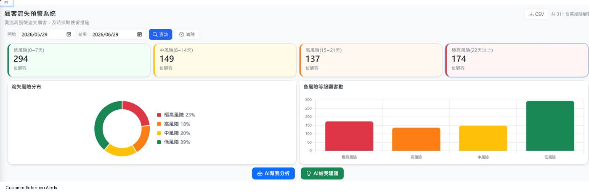
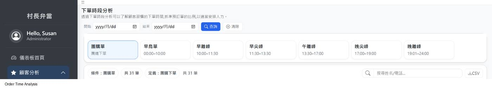
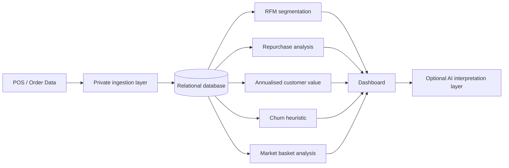

# Bento Customer Analytics

An end-to-end customer analytics project for a food-retail setting, covering **RFM segmentation, repurchase behaviour, annualised customer value, churn alerts, market basket analysis, and product preferences**.

This repository is a **privacy-safe public refactor** of a team industry-academic project. The original operational system used private POS/order data and a web dashboard; this edition isolates the analytical logic, replaces client data with reproducible synthetic data, and documents the assumptions behind each metric.

## Quick view

| Item | Summary |
|---|---|
| Project type | Team industry-academic analytics system |
| My role | Team Leader; approx. 35% contribution |
| Original data scale | Roughly 10,000 transaction/order records |
| Public data | 100% synthetic; no real customer-level records |
| Main methods | RFM, repurchase intervals, annualised spend proxy, recency alerts, association rules |
| Reproducibility | Fixed random seed, deterministic outputs, automated tests, GitHub Actions CI |
| Main stack | Python, pandas, NumPy, SQL; original dashboard also used PHP/HTML/CSS/JavaScript |

## Business problem

The project addressed a practical problem: transaction data existed, but store operators had limited tools for turning raw orders into customer-level insight. The system was designed to support questions such as:

- Which customers are recent, frequent and high-spending?
- How often do customers typically repurchase?
- Which customers may require retention attention?
- Which products tend to be purchased together?
- Which customers generate higher annualised spending?
- What products does each customer purchase most often?

## My role

**Team project — Team Leader | Approx. contribution: 35%**

My work focused on the analytics and system-development workflow, including parts of:

- database and data-flow design
- backend analytics implementation
- customer segmentation and behavioural analysis
- repurchase and customer-value analysis
- dashboard integration
- interpretation of analytical outputs for business use

The public repository intentionally does **not** imply that the entire original system was built by one person.

## Analytical methods

### 1. RFM customer segmentation

Customers are segmented using:

- **Recency** — days since last purchase
- **Frequency** — number of distinct orders
- **Monetary** — cumulative spend

The operational prototype used project-specific rule thresholds and produced segments including **Top Customers, Loyal Repeat, Potential Loyalists, At Risk, Dormant, and New Customers**. These thresholds are retained here for auditability and are explicitly treated as heuristics rather than universal cut-offs.

### 2. Repurchase analysis

For customers with at least two distinct purchase dates, the pipeline calculates consecutive purchase gaps and uses the **median repurchase interval** to reduce sensitivity to unusually long gaps.

### 3. Annualised customer value

The original dashboard labelled this metric `CLV(12M)`. In the public edition it is renamed **Annualised Customer Value** because it is a spending-rate proxy rather than a complete customer-lifetime-value model:

```text
annualised value = total observed spend / observed months × 12
```

The exposure window runs from the customer's first purchase to the analysis reference date, with a one-month floor for very new customers. A full CLV model would require additional assumptions such as retention, contribution margin, customer lifetime and discounting.

### 4. Churn alert heuristic

Customers are grouped by days since their most recent purchase:

- 0–7 days: Low
- 8–14 days: Medium
- 15–21 days: High
- 22+ days: Very High

This is a **recency-based operational alert**, not a predicted churn probability. The public refactor deliberately avoids a pseudo-probability score to reduce false precision.

### 5. Market basket analysis

Two-item association rules are calculated using:

- **Support**
- **Confidence**
- **Lift**

Directional rules are emitted in both directions (`A → B` and `B → A`) so confidence is interpreted against the correct antecedent.

### 6. Product preference analysis

Valid order-item data are aggregated at customer-product level to identify each customer's most frequently purchased product and associated spend.

## Reproducible public demo

The demo data are **100% synthetic** and generated locally with a fixed random seed. Running the generator and demo scripts produces deterministic CSV tables; only a compact result snapshot is committed to the repository.

Current synthetic demo summary:

| Metric | Synthetic demo result |
|---|---:|
| Valid orders | 710 |
| Customers | 120 |
| Synthetic revenue | TWD 114,230 |
| Customers with measurable repurchase intervals | 103 |
| Median repurchase interval | 8.5 days |
| Strongest synthetic basket rule | Grilled Chicken Bento → Tea Egg |
| Rule support | 8.73% |
| Rule confidence | 64.58% |
| Rule lift | 3.58 |

These figures are **not real business results**; they only demonstrate that the analytical pipeline is reproducible without exposing private data.

## System screenshots

The screenshots below are privacy-scrubbed views of the original dashboard interface. Customer-identifying table rows are excluded; the reproducible code and data in this public repository use synthetic data.

### Market Basket Analysis

Identifies frequently co-purchased products and supports bundle or recommendation analysis using association-rule metrics such as support, confidence and lift.



### Repurchase Behaviour Analysis

Groups customers by typical repurchase interval using the median gap between distinct purchase dates, helping describe repeat-purchase behaviour without assuming a predictive model.



### Customer Retention Alerts

Summarises customers by transparent recency-based risk bands. These alerts are operational heuristics rather than predicted churn probabilities.



### Order Time Analysis

Explores when customers tend to place orders across defined dayparts, supporting operational planning and staffing decisions.



## Architecture



In the original system, AI was used as an **interpretation layer after deterministic analytics were computed**. Core business metrics did not depend on a language model to generate the numbers.

## Original system vs public edition

| Original operational project | Public repository |
|---|---|
| Private POS/order data | Synthetic data only |
| Production dashboard and deployment environment | Reproducible analytics modules |
| Customer-level identifiers | Anonymous synthetic IDs |
| Operational credentials/configuration | Excluded |
| Prototype dashboard labels | Revised terminology where needed |
| Internal implementation history | Clean, auditable public code |

## Repository structure

```text
.
├── README.md
├── requirements.txt
├── .github/workflows/tests.yml
├── src/
│   └── analytics.py
├── scripts/
│   ├── generate_synthetic_data.py
│   └── run_demo.py
├── sample_data/
│   └── README.md              # generated CSVs are gitignored
├── outputs/
│   ├── README.md
│   └── demo_summary.json       # compact reproducible result snapshot
├── sql/
│   └── schema.sql
├── docs/
│   ├── architecture.md
│   ├── methodology.md
│   ├── limitations.md
│   ├── data_privacy.md
│   └── publication_checklist.md
└── tests/
    └── test_analytics.py
```

## Run locally

```bash
python -m venv .venv
# macOS/Linux: source .venv/bin/activate
# Windows: .venv\Scripts\activate
pip install -r requirements.txt
python scripts/generate_synthetic_data.py
python scripts/run_demo.py
pytest -q
```

## Data privacy

The public edition does **not** include customer names, phone numbers, raw operational exports, production IP addresses, login credentials, database passwords, SSH keys, or private API keys.

See [`docs/data_privacy.md`](docs/data_privacy.md) for the publication policy.

## Methodological limitations

This project deliberately distinguishes operational heuristics from validated predictive models:

- RFM thresholds are project-specific rather than statistically optimised.
- Annualised Customer Value is not full CLV.
- The churn alert is not a calibrated probability model.
- Market basket association does not establish causality.
- Synthetic data demonstrate reproducibility, not commercial impact.
- A prototype what-if screen from the private system is **not presented as a revenue forecast** because it was a deterministic scenario calculation rather than a validated forecasting model.

A detailed discussion is available in [`docs/limitations.md`](docs/limitations.md).

## What I learned

The most important lesson from this project was not simply how to calculate customer metrics, but how to make analytical claims proportionate to the underlying method. Refactoring the private system for public review required separating **descriptive analytics, operational heuristics, and predictive claims**, while also preserving reproducibility and protecting customer data.

## Technology

- Python / pandas / NumPy
- SQL / relational database design
- PHP in the original dashboard
- HTML / CSS / JavaScript in the original interface
- Gemini API in the original optional interpretation layer
- Git / GitHub / GitHub Actions
