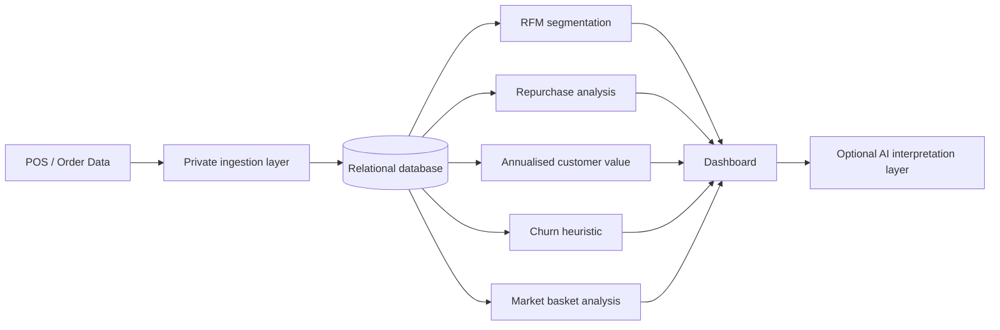

# Architecture

The original team system was a web-based analytics dashboard connected to POS/order data. The public portfolio edition deliberately separates the analytical logic from the private operational environment.

## Original stack

- PHP dashboard and server-side aggregation
- MySQL-compatible relational database
- Python automation jobs
- HTML/CSS/JavaScript dashboard components
- Gemini-based interpretation layer using environment variables for API credentials

## Public edition

- Python + pandas for reproducible analytics
- Synthetic demonstration data only
- No production URLs, credentials, customer names, phone numbers or deployment keys
- SQL schema rewritten around anonymous `customer_id`
